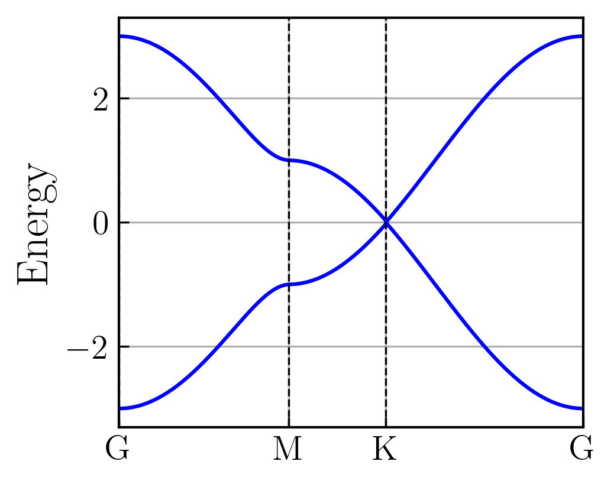
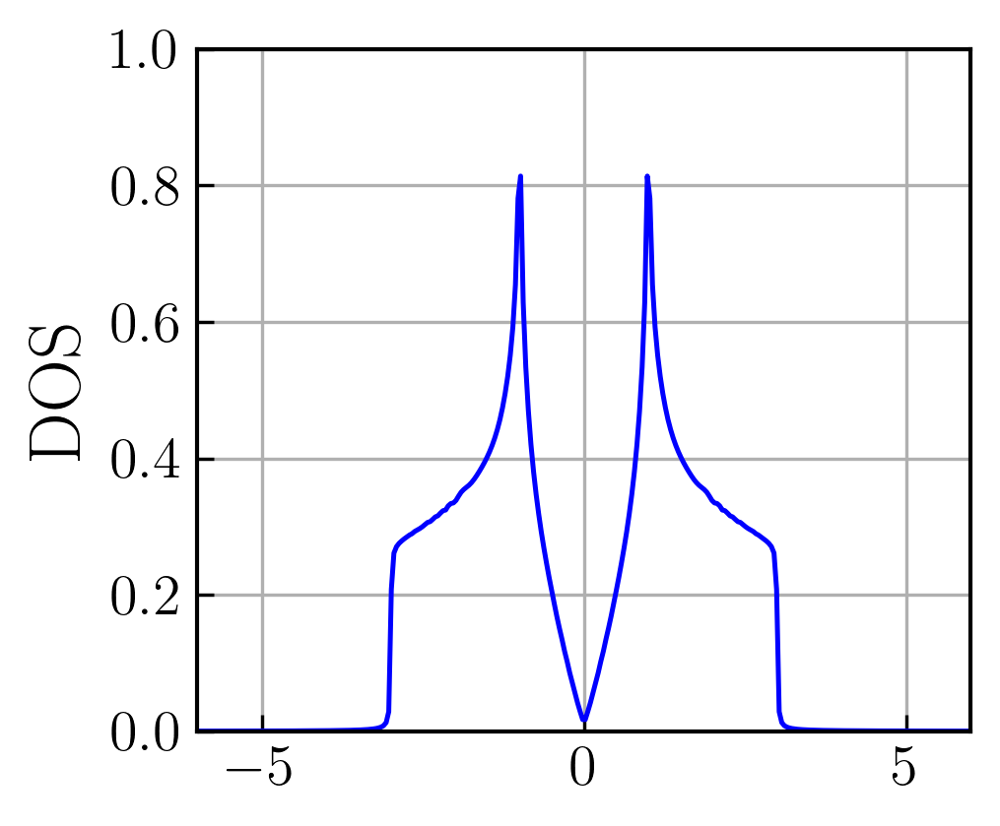
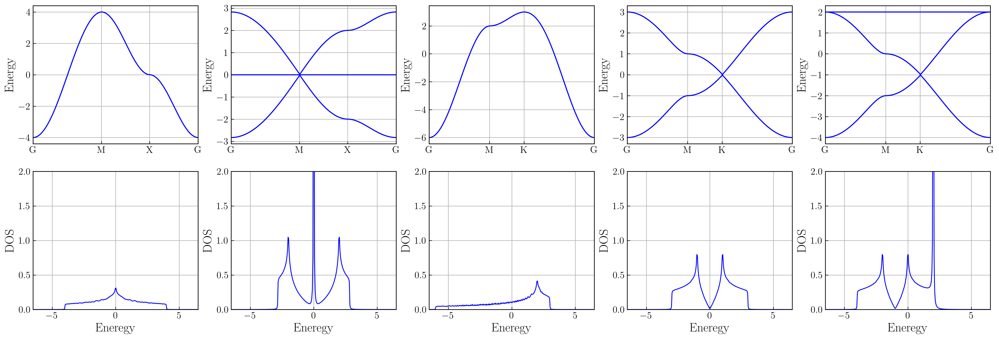

# tbforge

`tbforge` is a numerical package to construct tight-binding models on various lattices. It supports:

- 1D, 2D, and 3D lattice construction
- Nearest-neighbor (NN) and next-nearest-neighbor (NNN) hoppings
- Multi-orbital Hamiltonians with spin and particle-hole degrees of freedom
- Band structure and orbital/particle projection plotting


## Installation
```bash
pip install tbforge

git clone https://github.com/yourusername/tbforge.git
cd tbforge
pip install -e .
```

## Quick start
```python
#1. Create pre-defined lattice
lat = Lattice.honeycomb() #define bulk lattice

#2. Generate hoppings; without hopping radius, NN hopping is assumed
hops_nn, _ = Hopping().find_hops(lat) #assumes order=1 i.e. NN hop by deafult

#2. Build Hamiltonian & add ham terms 
h = Hamiltonian(norb=1, nspin=1, nph=1, 
                lat=lat, hops_nn=hops_nn)
h.add_mu(0.)
h.add_nnhops(amp=1.0)

#3. Define the high-symmetry kpath
kpath, kpath_1d, ticks = lat.find_kpath(n_kpts=300)

#4. Pass the Hamiltonian through solver to get bands
bands = Solver(h).get_bands(kpath)

#5. Plot bands using plotter
Plotter().plot_bands(bands, kpath_1d, ticks)
```


We can also plot DOS
```python
kgrid = lat.find_kgrid(mesh=[300,300,1])
dos = Solver(h).get_dos(kgrid, erange=np.linspace(-6,6,300))
Plotter().plot_dos(dos, ylim=[0,1])
```


Typical 2D lattices are pre-defined in `tbforge`
```python
f, axs = plt.subplots(2, 5, figsize=(25,8))

for i, lat in enumerate([Lattice.square(),
                         Lattice.lieb(),
                         Lattice.triangular(),
                         Lattice.honeycomb(),
                         Lattice.kagome()]):
    hops_nn, _ = Hopping().find_hops(lat, order=1)

    h = Hamiltonian(norb=1, nspin=1, nph=1, lat=lat, hops_nn=hops_nn)
    h.add_mu(0.)
    h.add_nnhops(amp=1.0)
    
    #Bands
    kpath, kpath_1d, ticks = lat.find_kpath(n_kpts=300)
    bands = Solver(h).get_bands(kpath)
    Plotter(axs[0,i]).plot_bands(bands, kpath_1d, ticks)

    #DOS
    kgrid = lat.find_kgrid(mesh=[300,300,1])
    dos = Solver(h).get_dos(kgrid, erange=np.linspace(-6.5,6.5,300))
    Plotter(axs[1,i]).plot_dos(dos)
```

For the notebook and more examples, see the [examples](./examples) directory.


