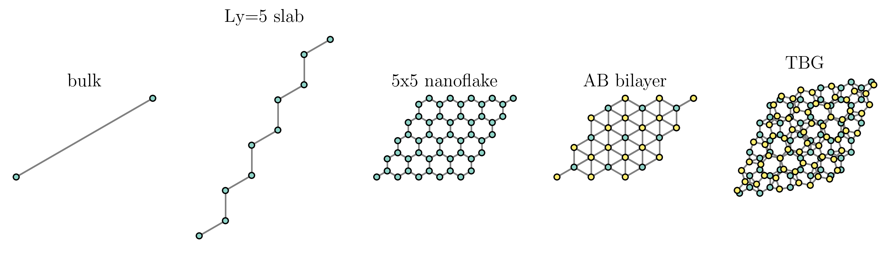
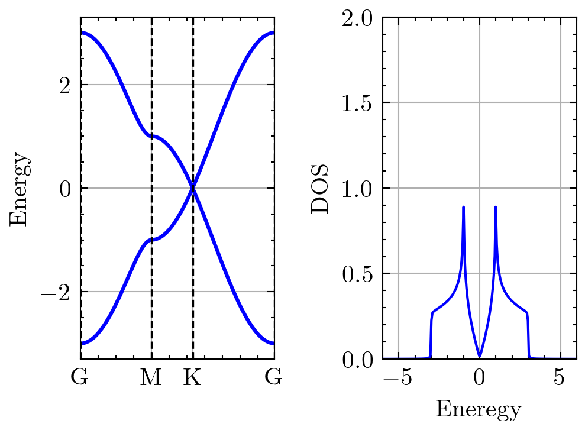
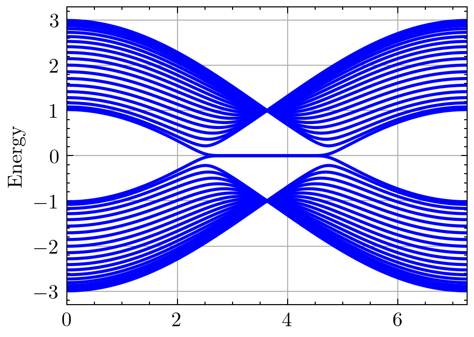
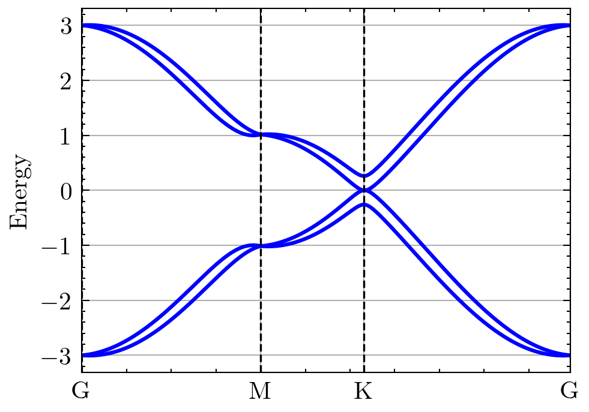
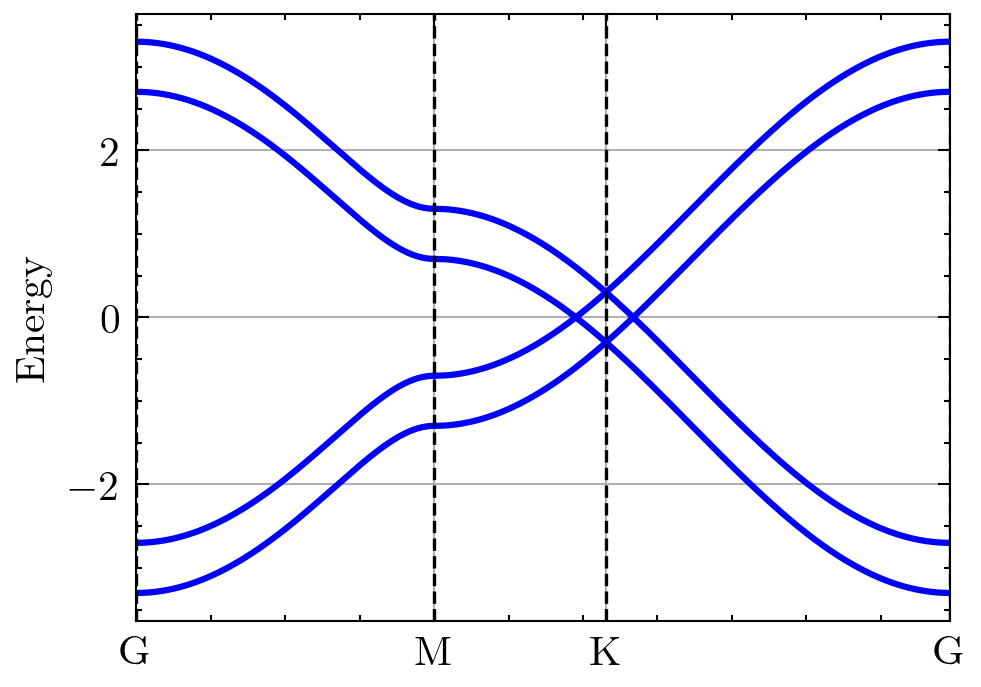
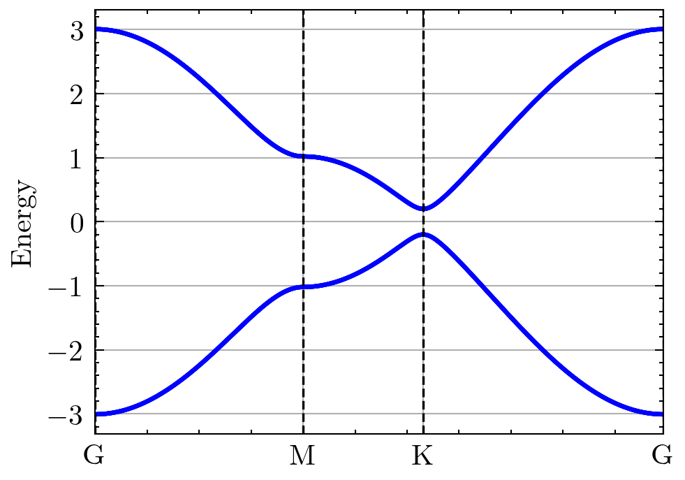
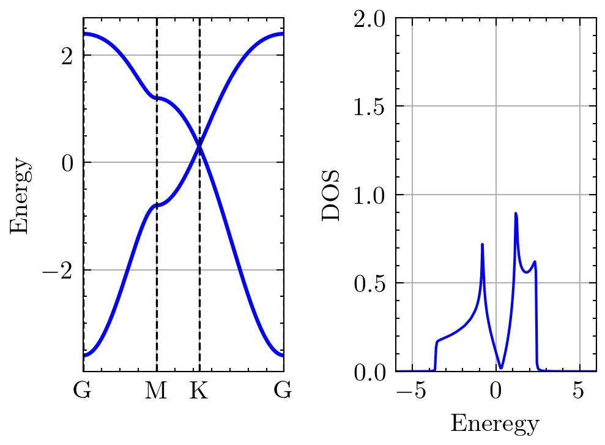
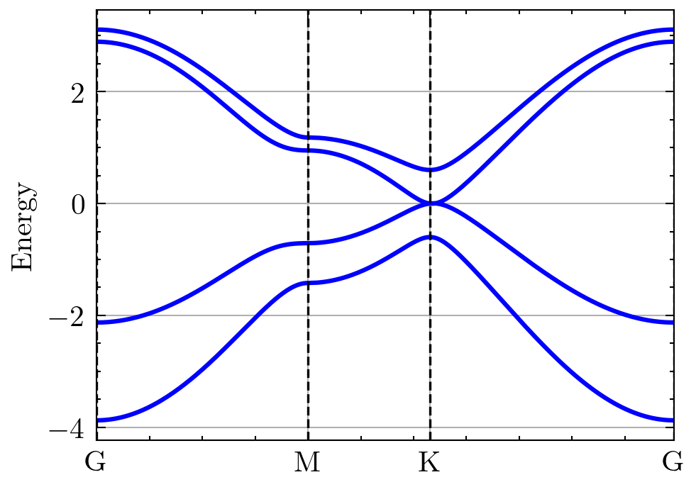
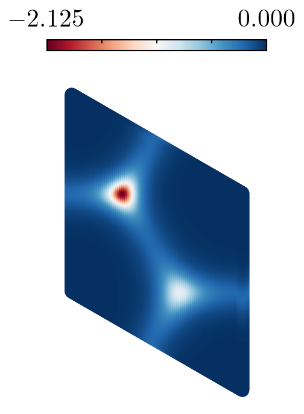

# tbforge

`tbforge` is a tight-binding library for electronic calculations. It supports

- Construction of bulk, slab, bilayer, moire lattice
- Automatic kmesh generation from lattice 
- Finding n-th neighbor hopping with/without periodicity
- Computation of DOS and band structure with support for projected bands
- Option to add spin and particle-hole degrees of freedom
- Possibility to construct multi-orbital Hamiltonians


## Installation
```bash
git clone https://github.com/z2gap/tbforge.git
cd tbforge
pip install -e .
```

## Documentation

### Import tbforge and standard libraries
```python
import numpy as np
import matplotlib.pyplot as plt

from tbforge.lattice import *
from tbforge.plotter import *
from tbforge.hopping import *
from tbforge.hamiltonian import *
from tbforge.solver import *
from tbforge.params import *
```


### Generate lattices
```python
#bulk honeycomb
bulk = Lattice.honeycomb() 

#slab geometry
slab = bulk.transform([1,5,1]) 

#finite nanoflake
finite = bulk.transform([5,5,1]) 

#bilayer
a1 = np.array([1., 0., 0.]); a2 = np.array([0.5, np.sqrt(3)/2, 0.]);
bilayer = Lattice.stack(bulk, n_layers=2, d=3.4,
                        shifts=[np.zeros(3), a1/3 + a2/3]).transform([3, 3, 1])

#moire
mc = Lattice.moire(5, 1, a=1.0, d=3.35, c=None);

#Plot lattice using Plotter class
sys = {'bulk':bulk, 'Ly=5 slab':slab, '5x5 nanoflake':finite, 'AB bilayer':bilayer, 'TBG':mc}
f, axs = plt.subplots(1, 5, figsize=(12, 3))
for i, (k, v) in enumerate(sys.items()):
    axs[i].axis('off')
    axs[i].set_title(k)
    Plotter(axs[i]).plot_lattice(v, add_bond=True)
```


### Save lattices as POSCAR
```python
bulk = Lattice.honeycomb() #create bulk

#use save method of Lattice class to export
bulk.save("POSCAR", species="C") 
```

### Electronic DOS and bands
```python
lat = Lattice.honeycomb() #generate lattice

#create Hamiltonian
h = Hamiltonian(lat).add_nnhops().set_params(t=1.0).finalize() 

f, axs = plt.subplots(1,2, tight_layout=True)

 #Solve eigenvalue problem & plot bands 
Solver(h).plot_bands(lat, ax=axs[0]);

#generate G-centered kmesh from lat for DOS
kgrid = lat.find_kgrid([500, 500, 1]) 
Solver(h).plot_dos(erange=np.linspace(-6,6, 200), kpts=kgrid); #plot DOS
```



### Slab bands
```python
#Create a ribbon of length L=20 along y-direction and set 
#periodic boundary condition bc=[1,0,0] along x-direction
lat = Lattice.honeycomb().transform([1,20,1], bc=[1,0,0])

h = Hamiltonian(lat).add_nnhops().set_params(t=1.0).finalize() #create Hamiltonian

Solver(h).plot_bands(lat);

plt.savefig('../images/slab-bands.png', dpi=300)
```



### Rashba SOC
```python
lat = Lattice.honeycomb() #create lattice

h = Hamiltonian(lat, nspin=2) #initialize Hamiltonian
h.add_nnhops()  #NN hopping  
h.add_rashba()  #Rashba SOC  
h.set_params(t=1.0, rsoc=0.15) #set parameters 
h.finalize() #finalize

Solver(h).plot_bands(lat); #plot bulk bands
```



### Zeeman field
```python
lat = Lattice.honeycomb() #create lattice

h = Hamiltonian(lat, nspin=2) #initialize Hamiltonian
h.add_nnhops()  #NN hopping    
h.add_zeeman()  #Rashba SOC   
h.set_params(t=1.0, hz=0.3)
h.finalize() #finalize

Solver(h).plot_bands(lat);  #plot bulk bands
```



### s-wave pairing
```python
lat = Lattice.honeycomb() #create lattice

h = Hamiltonian(lat, nspin=2, nph=2) #initialize Hamiltonian
h.add_nnhops()  #NN hopping    
h.add_s_wave() #out-of-plane
h.set_params(t=1.0, delta_s=0.2)
h.finalize() #finalize

Solver(h).plot_bands(lat);  #plot bulk bands
```



### NNN hopping
```python
lat = Lattice.honeycomb() #generate lattice

#create Hamiltonian
h = Hamiltonian(lat).add_nnhops().add_2nnhops().set_params(t=1.0, tnnn=0.1).finalize() 

f, axs = plt.subplots(1,2, tight_layout=True)

 #Solve eigenvalue problem & plot bands 
Solver(h).plot_bands(lat, ax=axs[0]);

#generate G-centered kmesh from lat for DOS
kgrid = lat.find_kgrid([500, 500, 1]) 
Solver(h).plot_dos(erange=np.linspace(-6,6, 200), kpts=kgrid); #plot DOS
```



### AB bilayer honeycomb bands
```python
bulk = Lattice.honeycomb(a=1.0) #define bulk

#lattice vectors; (a1/3)+(a2/3) shift for 2nd layer
a1 = np.array([1., 0., 0.])
a2 = np.array([0.5, np.sqrt(3)/2, 0.])
bilayer = Lattice.stack(bulk, n_layers=2, d=1.0,
                        shifts=[np.zeros(3), (a1/3)+(a2/3)]) #create bilayers

h = Hamiltonian(bilayer)
h.add_nnhops()
h.add_interlayer(dz=1.0, lam_decay=0.1)   # <-- decay length here
h.set_params(t=1.0, tz=0.3)
h.finalize()

Solver(h).plot_bands(bilayer)
```



### Berry curvature and Chern number
```python
# Build the system
lat = Lattice.honeycomb()

# Build Hamiltonian
h = Hamiltonian(lat)
h.add_nnhops()
h.add_haldane()
h.add_stag_pot()
#tH=Haldane NNN coupling, Vstag=staggered potential
h.set_params(t=1.0, tH=0.1, Vstag=0.1) 
h.finalize()

# k-grid — find_kgrid returns a flat (Nk, 3) array
kgrid = lat.find_kgrid(mesh=[200, 200, 1])

# Compute Berry curvature — returns (omega, chern_number)
omega, chern = Solver(h).get_berry_curvature(kgrid)
print(f"Chern number: {chern:.4f}")

# Plot — omega is (Nk, 3): columns are kx, ky, Ω_z
Plotter().plot_berry_curvature(omega)
```



